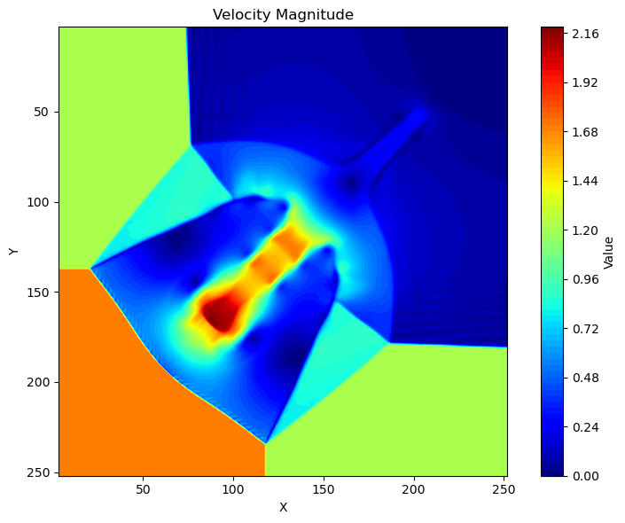
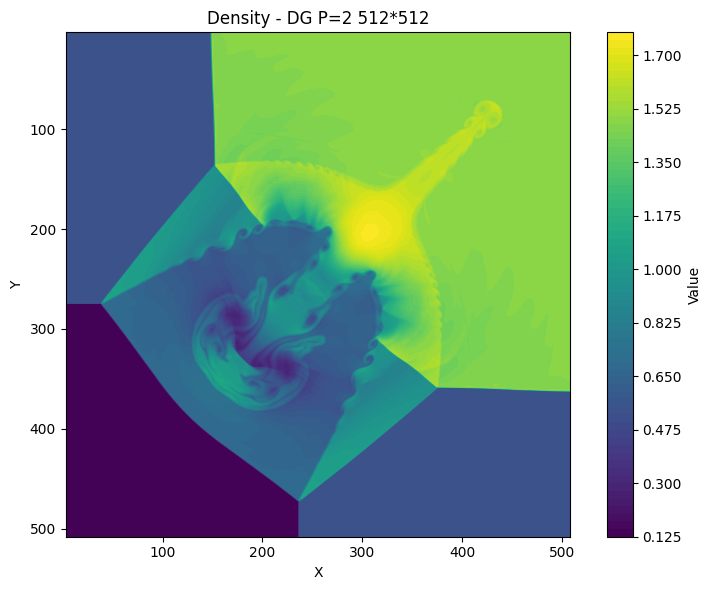
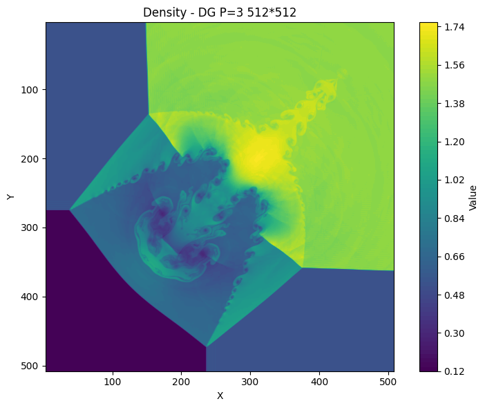
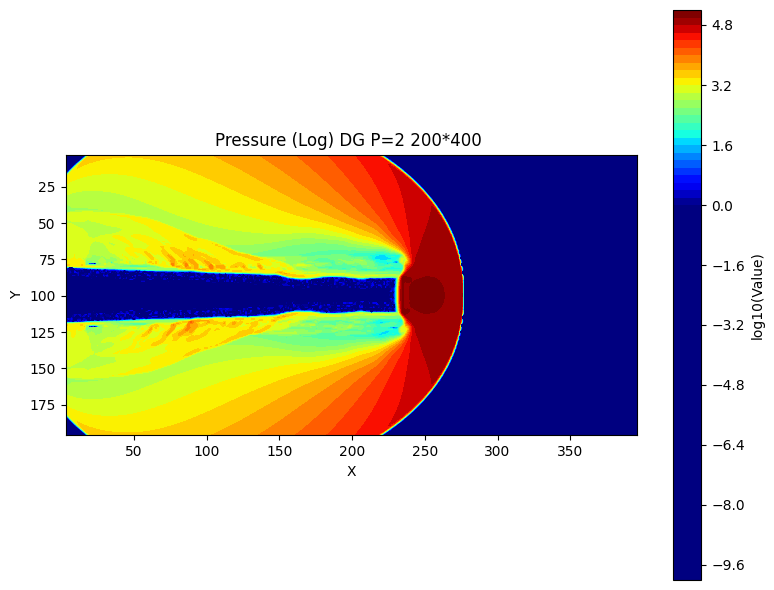
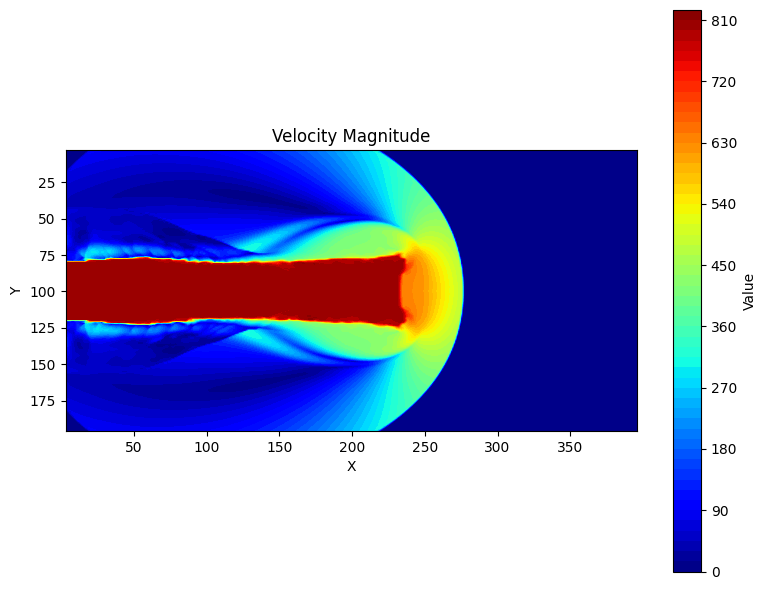

# ZuikakuCFD：二维欧拉方程高阶并行求解器


## 概览

ZuikakuCFD 是一个为**二维可压缩 Euler 方程**设计的高阶数值求解框架。项目提供两种互补的有限元方法实现：

| 方法 | 离散格式 | 精度 | 特色 | 位置 |
|------|--------|------|------|------|
| **WENO5 有限体积** | WENO5 重构 | 5阶 | 激波锐利、经典成熟 | [src_WENO/](src_WENO/) |
| **DG 间断伽辽金** | Legendre多项式 | 2/3/4阶 | 通信高效、自适应精度 | [src_DG/](src_DG/) |

两种求解器均采用 **HLLC Riemann求解器** 处理数值通量，使用 **列方向 MPI 域分解** 实现并行计算。

---

## 前置知识

本项目面向有限元方法、CFD 数值求解器开发人员。建议了解：
- 二维可压缩 Euler 方程基本形式
- 有限体积法和间断伽辽金法的基本原理
- MPI 并行编程基础
- Riemann 求解器概念

---

## 理论基础

### 守恒律系统

求解的二维可压缩 Euler 方程为：

$$\frac{\partial \mathbf{U}}{\partial t} + \frac{\partial \mathbf{F}(\mathbf{U})}{\partial x} + \frac{\partial \mathbf{G}(\mathbf{U})}{\partial y} = 0$$

其中守恒变量向量和物理通量为：

$$\mathbf{U} = \begin{bmatrix} \rho \\ \rho u \\ \rho v \\ E \end{bmatrix}, \quad \mathbf{F} = \begin{bmatrix} \rho u \\ \rho u^2 + p \\ \rho uv \\ (E+p)u \end{bmatrix}, \quad \mathbf{G} = \begin{bmatrix} \rho v \\ \rho uv \\ \rho v^2 + p \\ (E+p)v \end{bmatrix}$$

其中 $\rho$ 为密度，(u,v) 为速度分量，$E$ 为总能量，压力由理想气体状态方程：

$$p = (\gamma - 1)\left(E - \frac{1}{2}\rho(u^2 + v^2)\right)$$

确定，$\gamma$ 为比热比。

### 时间离散：SSP-RK3

采用三阶强稳定性保持 Runge-Kutta (SSP-RK3) 格式：

$$\mathbf{U}^{(1)} = \mathbf{U}^n + \Delta t \mathcal{L}(\mathbf{U}^n)$$
$$\mathbf{U}^{(2)} = \frac{3}{4}\mathbf{U}^n + \frac{1}{4}\left(\mathbf{U}^{(1)} + \Delta t \mathcal{L}(\mathbf{U}^{(1)})\right)$$
$$\mathbf{U}^{n+1} = \frac{1}{3}\mathbf{U}^n + \frac{2}{3}\left(\mathbf{U}^{(2)} + \Delta t \mathcal{L}(\mathbf{U}^{(2)})\right)$$

其中 $\mathcal{L}(\mathbf{U})$ 为空间离散算子。

---

## 数值方法

### 方法一：WENO5 有限体积格式

#### 空间离散

在统一网格 $[x_i, x_{i+1}] \times [y_j, y_{j+1}]$ 上定义单元均值：

$$\bar{\mathbf{U}}_{i,j}^n = \frac{1}{\Delta x \Delta y} \int_{x_i}^{x_{i+1}} \int_{y_j}^{y_{j+1}} \mathbf{U}(x,y,t^n) \, dy\,dx$$

有限体积更新格式：

$$\frac{d\bar{\mathbf{U}}_{i,j}}{dt} = -\frac{1}{\Delta x}\left(\mathbf{F}^*_{i+1/2,j} - \mathbf{F}^*_{i-1/2,j}\right) - \frac{1}{\Delta y}\left(\mathbf{G}^*_{i,j+1/2} - \mathbf{G}^*_{i,j-1/2}\right)$$

其中 $\mathbf{F}^*_{i+1/2,j}$ 和 $\mathbf{G}^*_{i,j+1/2}$ 为数值通量。

#### WENO5 重构

在 $x$ 方向界面处重构左右状态，使用6点模板 $\{u_{i-2}, u_{i-1}, u_i, u_{i+1}, u_{i+2}, u_{i+3}\}$。

通过 Jiang-Shu 光滑指示子自适应组合三个二次多项式，在光滑区达到5阶精度，在间断区自动降阶保证 TVD 性质。

**参考函数**：[src_WENO/fluid.cpp](src_WENO/fluid.cpp) 的 `weno5_reconstruct()`

#### HLLC Riemann 求解器

在界面处求解 Riemann 问题，得到数值通量：

$$\mathbf{F}^* = \begin{cases}
\mathbf{F}_L & \text{if } S_L \geq 0 \\
\mathbf{F}^*_L & \text{if } S_L < 0 \leq S^* \\
\mathbf{F}^*_R & \text{if } S^* \leq 0 < S_R \\
\mathbf{F}_R & \text{if } S_R \leq 0
\end{cases}$$

其中 $S_L, S^*, S_R$ 为左波、接触间断、右波的速度，$\mathbf{F}^*_L, \mathbf{F}^*_R$ 为中间状态的通量。

**参考函数**：[src_WENO/fluid.cpp](src_WENO/fluid.cpp) 的 `hllcFlux()`

---

### 方法二：DG 间断伽辽金格式

#### 基本理论

DG 方法在每个单元 $K$ 上用多项式族逼近解。对测试函数 $\phi_k$，弱形式为：

$$\int_K \phi_k \frac{\partial \mathbf{U}}{\partial t} d\mathbf{x} = -\int_K \left(\mathbf{F} \frac{\partial \phi_k}{\partial x} + \mathbf{G} \frac{\partial \phi_k}{\partial y}\right) d\mathbf{x} + \oint_{\partial K} \mathbf{F}^*_{\text{num}} \cdot \mathbf{n} \phi_k \, d\gamma$$

#### Legendre 正交基

选择二维张量积 Legendre 多项式基：

$$\varphi_m(\xi,\eta) = L_{p_x}(\xi) \cdot L_{p_y}(\eta), \quad \xi,\eta \in [-1,1]$$

其中 $m = p_x(P+1) + p_y$，$p_x, p_y \in [0,P]$，$L_p$ 为 $p$ 阶 Legendre 多项式，满足正交性：

$$\int_{-1}^1 L_i(\xi) L_j(\xi) d\xi = \frac{2}{2i+1}\delta_{ij}$$

每个单元的解表示为：

$$\mathbf{U}_h(\xi,\eta,t) = \sum_{m=0}^{N_M-1} \hat{\mathbf{U}}_m(t) \varphi_m(\xi,\eta)$$

其中 $N_M = (P+1)^2$ 为该单元的自由度总数。

#### 数值积分

使用 Gauss-Legendre 求积：
- **体积分**（3×3点）：精确至5次多项式
- **面积分**（3点）：与多项式阶次匹配

#### Cockburn-Shu 限制器

**设计目标**：在保持光滑区高阶精度的前提下，消除激波附近的 Gibbs 振荡。

**实现策略**：
1. 对单元 $(i,j)$ 的线性模式 $(m = 1, 2)$ 应用 minmod 限制
2. 若线性系数被修改，清零所有高阶模式 $(m \geq 3)$

**Minmod 函数**：
$$\text{minmod}(a_1, a_2, \ldots) = \begin{cases}
s \cdot \min_i|a_i| & \text{if all } a_i \text{ 同号} \\
0 & \text{otherwise}
\end{cases}, \quad s = \text{sign}(a_1)$$

**自适应行为**：
- 光滑区：限制器不激活 → 保持 $(P+1)$ 阶精度
- 激波处：限制器激活 → 降至分段线性（2阶）

**参考函数**：[src_DG/fluid.cpp](src_DG/fluid.cpp) 的 `applyCockburnShuLimiter()`

#### CFL 稳定条件

$$\Delta t_{\max} = \frac{C}{2(2P+1)} \cdot \frac{h}{\lambda_{\max}}, \quad C = 0.9$$

其中 $\lambda_{\max}$ 为最大特征速度，$h$ 为网格尺寸。

---

## 系统架构

### 并行策略

采用**列方向域分解**：沿 $x$ 方向将全局网格均匀切分为 $n_{\text{proc}}$ 个子域，每个 MPI 进程负责一个子域。

**Ghost 层配置**：
- **WENO5**：每侧 3 层 ghost（支持 6 点重构模板）
- **DG**：每侧 1 层 ghost（多项式界面求值）

**通信模式**：SSP-RK3 每个阶段后进行一次 MPI 通信，交换所有 4 个守恒变量的 ghost 层。

### 文件结构

```
ZuikakuCFD/
├── src_WENO/              # 有限体积 WENO5 实现
│   ├── fluid.h            # 网格数据结构与 API
│   ├── fluid.cpp          # 重构、通量、时间推进
│   └── solver.cpp         # MPI 主程序、时间循环
├── src_DG/                # DG 间断伽辽金实现
│   ├── fluid.h            # DG 网格扩展（模态系数存储）
│   ├── fluid.cpp          # Legendre 基、弱形式、限制器
│   └── solver.cpp         # DG 主程序、自适应 CFL
├── 2D-Riemann/            # 标准测试网格数据
├── HighMachJet/           # 天体物理喷流算例
├── img/                   # 结果展示图片
│   ├── HMJP.png           # 喷流压力分布
│   ├── HMJV.png           # 喷流速度幅值
│   ├── WENO5.png          # Riemann 问题 WENO5 结果
│   ├── DG2.png            # Riemann 问题 DG(P=2) 结果
│   └── DG3.png            # Riemann 问题 DG(P=3) 结果
├── Makefile               # 构建脚本
├── gen.ipynb              # 网格生成示例
├── plot.ipynb             # 结果后处理脚本
├── LICENSE                # MIT 许可证
└── README.md              # 本文件
```

---

## 快速开始

### 系统要求

- **C++ 编译器**：GCC 7+、Clang 5+ 或 MSVC 2017+（需 C++17 支持）
- **MPI**：OpenMPI 3.0+ 或 MPICH 3.0+（需 `mpic++` 可用）
- **Eigen3**：仅需头文件（通常已在系统库中）

**验证环境**：
```bash
which mpic++         # 可用性检查
mpic++ --version     # 显示 MPI 版本
```

### 编译

```bash
# 编译所有版本（WENO5 + DG P=1,2,3）
make all

# 仅编译 WENO5
make weno

# 仅编译 DG（生成 solver_DG2, solver_DG3, solver_DG4）
make dg

# 清理
make clean          # 删除中间文件和可执行文件
make distclean       # 同上 + 清理输出
```

### 基本运行

#### WENO5 有限体积格式
```bash
# 固定时间步、指定步数
mpirun -np 4 ./solver_WENO ./2D-Riemann 1e-4 1000
```

参数说明：网格文件夹、时间步 $\Delta t$、总步数

#### DG 间断伽辽金格式
```bash
# 自适应 CFL、指定步数
mpirun -np 4 ./solver_DG3 ./2D-Riemann auto 1000
```

参数说明：网格文件夹、`auto`（自动CFL）或时间步值、总步数

### 可视化

使用 Jupyter notebook 后处理：

```bash
jupyter notebook plot.ipynb
```

脚本将加载 `result/` 目录中的并行输出数据，拼接为全局场景，计算原始变量和 Mach 数，绘制等高线图。

---

## 详细文档

### 网格格式

#### 参数文件 `params.txt`
```
nx ny da gamma
```

| 字段 | 含义 | 类型 | 示例 |
|------|------|------|------|
| nx | x 方向单元数 | int | 512 |
| ny | y 方向单元数 | int | 512 |
| da | 均匀网格尺寸 | double | 0.002 |
| gamma | 比热比 | double | 1.4 |

#### 初值文件（纯文本矩阵格式，行优先，尺寸 `ny × nx`）

| 文件 | 物理量 | 单位 |
|------|--------|------|
| `rho.dat` | 密度 $\rho$ | kg/m³ |
| `u.dat` | x 速度 $u$ | m/s |
| `v.dat` | y 速度 $v$ | m/s |
| `p.dat` | 压力 $p$ | Pa |
| `bctype.dat` | 边界标记（整数） | — |

#### 边界标记编码

```
  0 : 内部单元（参与计算）
 -1 : 固壁 ghost 单元（镜像复制）
 -3 : MPI 间 ghost 单元（通信填充）
```

### 数值精度与参数选择

| 方法 | 阶数 | ghost层 | 模式/单元 | CFL上限 | 推荐场景 |
|------|-----|--------|---------|--------|---------|
| MUSCL | 2 | 3 | 1 | 0.4 | 低成本快速测试 |
| **WENO5** | **5** | **3** | **1** | **0.4** | **强激波、工业应用** |
| DG(P=1) | 2 | 1 | 4 | 0.167 | 激波主导问题 |
| **DG(P=2)** | **3** | **1** | **9** | **0.100** | **均衡精度/成本** |
| DG(P=3) | 4 | 1 | 16 | 0.067 | 高精度光滑场 |

### 性能优化

#### WENO5 版本
- 栈分配 `double[4]` 替代 `vector`，消除堆分配开销
- Ghost 填充采用两遍扫描避免 O(N²) bctype 检测
- OpenMP 并行化内层循环（行向量化）
- 关键函数（WENO5、HLLC）inline 优化

#### DG 版本
- Legendre 多项式值预计算与缓存
- 所有 4 个变量×所有模式一次 MPI 通信打包
- 恢复原始变量与最大波速计算合并循环
- 单层 ghost 通信量相比 WENO5 减少 67%

---

## 典型测试用例

### 用例一：二维黎曼问题（Riemann Problem）

#### 问题设置

标准四象限黎曼问题，全局网格 **512×512**，四个象限独立初始化：

| 象限 | 位置 | $\rho$ | $u$ | $v$ | $p$ |
|------|------|--------|--------|---------|---------|
| 右上 | $x \geq 0.5, y \geq 0.5$ | 1.5 | 0.0 | 0.0 | 1.5 |
| 左上 | $x < 0.5, y \geq 0.5$ | 0.5323 | 1.206 | 0.0 | 0.3 |
| 左下 | $x < 0.5, y < 0.5$ | 0.138 | 1.206 | -1.206 | 0.029 |
| 右下 | $x \geq 0.5, y < 0.5$ | 0.5323 | 0.0 | -1.206 | 0.3 |

#### 物理特征

中心的四条间断线各形成激波、膨胀波或接触间断的复杂相互作用。是验证**多维激波捕捉、格点对称性、间断分辨率**的经典 test case。

#### 运行与对比

```bash
make all

# WENO5（5阶精度）
mpirun -np 4 ./solver_WENO ./2D-Riemann time 0.8

# DG(P=2)（3阶精度）
mpirun -np 4 ./solver_DG3 ./2D-Riemann time 0.8

# DG(P=3)（4阶精度）
mpirun -np 4 ./solver_DG4 ./2D-Riemann time 0.8

# 后处理
jupyter notebook plot.ipynb
```

#### 结果展示

| WENO5 | DG(P=2) | DG(P=3) |
|-------|---------|---------|
|  |  |  |

**特点**：
- **WENO5**：激波锐利、无振荡，但需 3 层 ghost 通信
- **DG(P=2)**：光滑且均衡，自动限制器消除 Gibbs 振荡
- **DG(P=3)**：高精度刻画细化结构，但时间步最严格

---

### 用例二：天体物理超高马赫数喷流

#### 问题描述

极音速喷流（ Mach ≈ 2700）从左边界射入低速背景，激发复杂的激波-膨胀-接触间断相互作用。

#### 计算参数

| 参数 | 值 | 说明 |
|------|-----|------|
| 计算域 | $[0, 1] \times [-0.25, 0.25]$ | 长宽比 |
| 喷流出口 | $x=0, y \in [-0.05, 0.05]$ | 左边界条件 |
| 喷流状态 | $\rho=5, u=800, v=0, p=0.4127$ | 出口条件 |
| 背景状态 | $\rho=0.5, u=0, v=0, p=0.4127$ | 初值 |
| 比热比 | $\gamma = 5/3$ | 单原子气体 |
| 网格 | $400 \times 200$ | 推荐 |

#### 求解与结果

```bash
# DG P=2 求解
mpirun -np 4 ./solver_DG2 HighMachJet 1e-8 100000

```

| 压力分布（DG P=2） | 速度幅值（DG P=2） |
|----------|----------|
|  |  |

#### 物理现象

1. **喷流头部激波**：极高压力比、密度比
2. **膨胀扇**：接触面两侧的膨胀波
3. **接触间断**：密度跳跃但压力连续
4. **剪切层涡量**：速度剪切诱发的集中涡量
5. **数值鲁棒性考验**：极端流动参数对激波捕捉精度的极致要求

---

## 常见问题与故障排除

**Q: 何时选用 WENO5 vs DG？** 
A: WENO5 适合强激波问题（如爆炸、撞击）；DG 适合光滑流或多项式适配（如层流、稀薄气体）。在精度相当时，DG 通信开销更小。

**Q: DG 为什么需要限制器？**
A: DG 多项式在间断处通常产生 Gibbs 振荡。Cockburn-Shu 限制器在检测到陡峭梯度时自动激活，强制降阶以消除振荡。

**Q: 如何改变 DG 精度？**
编辑 [src_DG/fluid.h](src_DG/fluid.h) 并重新编译：
```cpp
static constexpr int DG_P = 2;  // 改为 1, 2 或 3
```
```bash
make distclean && make dg
```

**Q: 结果出现 NaN 或数值爆炸？**
- **WENO5**：检查 CFL 数是否过大（应 ≤ 0.4），减小 `dt`
- **DG**：若手动指定 `dt`，需满足 CFL 条件；建议使用 `auto` 模式

**Q: 不同进程数结果不一致？**
A: 浮点数舍入誤差在并行中累积。网格切分点处应接近，但不会完全相同。若误差 > 1%，检查是否有 race condition 或通信错误。

---

## 许可与引用

**许可证**：MIT License（见 [LICENSE](LICENSE)）

**引用**：若在学术出版中使用本代码，请参考以下关键文献：

1. **DG 方法与限制器**：
   - Cockburn, B., & Shu, C. W. (2001). *Runge–Kutta Discontinuous Galerkin Methods for Convection-Dominated Problems*. Journal of Scientific Computing, 16(3), 173-261.

2. **WENO 重构**：
   - Jiang, G. S., & Shu, C. W. (1996). *Efficient Implementation of Weighted ENO Schemes*. Journal of Computational Physics, 126(1), 202-228.

3. **Riemann 求解器**：
   - Toro, E. F. (2009). *Riemann Solvers and Numerical Methods for Fluid Dynamics: A Practical Introduction* (3rd ed.). Springer-Verlag.

4. **激波捕捉与限制器**：
   - Barth, T. J., & Jespersen, D. C. (1989). *The Design and Application of Upwind Schemes on Unstructured Meshes*. AIAA Paper 89-0366.

---

## 扩展方向

可进一步开发的方向包括：

- 二维同时域分解（减少通信边界）
- 自适应网格细化（AMR）
- 反应涡燃烧模型耦合
- GPU 加速（CUDA/HIP）
- 更高阶 DG（P≥4）
- 稀有气体 BGK 碰撞模型
- 磁流体动力学（MHD）扩展

---

## 致谢与支持

- 基于经典有限体积和间断伽辽金理论
- 利用 Eigen 高性能线性代数库
- OpenMPI/MPICH 提供稳定的并行基础
- 感谢哈工大威海周军伟老师提供的指导
---

**项目信息**  
- **作者**：midway酱  
- **创建时间**：2024  
- **最后更新**：2026年3月  
- **版本**：1.0
